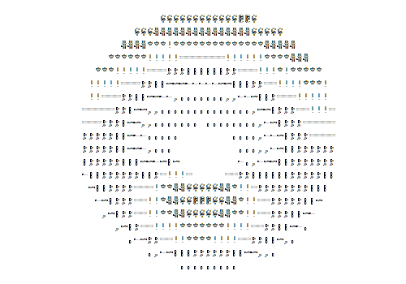

  
  

    
    
    
  

  

    
  

### 👨‍🎓 About Me :
  
I am an computer science student who has always been passionate about programming, from Italy.
  - 🔭 My goals: Artificial Intelligence , Security
  - 🌱 I am currently exploring Rust
  - ⚡ In my free time i like to keep track of my personal objectives and learn new stuff.
  - 📫 How to reach me: 

---

### 🛠️ Languages and Tools :

  &nbsp;
  
  
  
  
  
  
  
  
  

---

